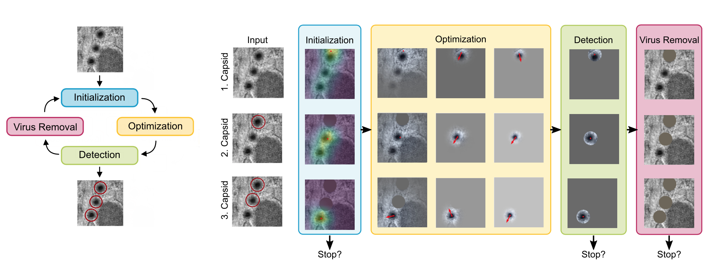

# Weakly Supervised Virus Capsid Detection with Image-Level Annotations in Electron Microscopy Images

This codebase hosts all code of the project of "Weakly Supervised Virus Capsid Detection with Image-Level Annotations in Electron Microscopy Images", poster at ICLR 2024.

## Abstract
Current state-of-the-art methods for object detection rely on annotated bounding boxes of large data sets for training. However, obtaining such annotations is expensive and can require up to hundreds of hours of manual labor. This poses a challenge, especially since such annotations can only be provided by experts, as they require knowledge about the scientific domain. To tackle this challenge, we propose a domain-specific weakly supervised object detection algorithm that only relies on image-level annotations, which are significantly easier to acquire. Our method  distills the knowledge of a pre-trained model, on the task of predicting the presence or absence of a virus in an image, to obtain a set of pseudo-labels that can be used to later train a state-of-the-art object detection model. To do so, we use an optimization approach with a shrinking receptive field to extract virus particles directly without specific network architectures. Through a set of extensive studies, we show how the proposed pseudo-labels are easier to obtain, and, more importantly, are able to outperform other existing weak labeling methods, and even ground truth labels, in cases where the time to obtain the annotation is limited.



## Getting Started 
To get started using the repository, please follow the instructions below.

### Docker (recommended)
We recomment to make use of the provided docker image [hannahkniesel/wscd:latest](https://hub.docker.com/r/hannahkniesel/wscd). 
This docker image is built upon the `1.12.0-cuda11.3-cudnn8-runtime` base image from [here](https://hub.docker.com/layers/pytorch/pytorch/1.12.0-cuda11.3-cudnn8-runtime/images/sha256-1ef1f61b13738de8086ae7e1ce57c89f154e075dae0b165f7590b9405efeb6fe?context=explore) and additionally contains all other requirements.
```bash
docker run --gpus all -it -p 8888:8888 --rm --ipc=host -v <path-to-repository>:/WSCD/ -w /WSCD/ --name wscd_c hannahkniesel/wscd:latest bash
```
In case you want to store the data in a different place locally, please do: 
```bash
docker run --gpus all -it -p 8888:8888 --rm --ipc=host -v <path-to-repository>:/WSCD/ -v <path-to-data>:/WSCD/Data/ -w /WSCD/ --name wscd_c hannahkniesel/wscd:latest bash
```

### Pip
```
pip install -r requirements.txt
```

### Conda
```
conda env create -f environment.yml
```

### Deterministic Mode

Our code is implemented in deterministic mode. If you are not running the code in the provided docker, please set the following environment variable before running the code:
```
export CUBLAS_WORKSPACE_CONFIG=:16:8
```

## Data
The data used in this project is available at [LINK](https://viscom.datasets.uni-ulm.de/WSCD/Data.zip). 

The data was previousely introduced in 

>Devan, K. S., Walther, P., von Einem, J., Ropinski, T., Kestler, H. A., & Read, C. (2019). Detection of herpesvirus capsids in transmission electron microscopy images using transfer learning. Histochemistry and cell biology, 151, 101-114.

>Matuszewski, D. J., & Sintorn, I. M. (2021). TEM virus images: Benchmark dataset and deep learning classification. Computer Methods and Programs in Biomedicine, 209, 106318.

Please download the data and put it in the `Data` folder inside this repository. The data folder should have the following structure:
```
Data
├── Herpes
│   └── Crops
│   │   ├── Test
│   │   ├── Train
│   │   ├── Val
│   │   ├── TimingsLocation.pkl
│   │   ├── TimingsBoundingBox.pkl
│   │   └── TimingsBinary.pkl
└── LargeScaleTEM
    ├── Adenovirus
    ├── Papilloma
    ├── Norovirus
    └── Rotavirus
        ├── test
        ├── train
        ├── validation
        └── annotation_time.txt
```

Alternatively, you can modify the paths in `Variables.py` to point to your data folder.


## WandB Logging
This codebase uses [Weights & Biases](https://wandb.ai/) for logging, therefore we require you to login to your WandB account before running the code. To do so, please run the following command:
```
export WAND_API_KEY=<YOUR_API_KEY>
```

## Usage
To run Ours(Opt) on all the available data do
```bash
python Main_Binary.py --project WSCD --seeds 42 123 7353 --annotation_time -1 --percentage 1 --data_split test
```

To run Ours(OD) on all the available data do 
```bash
python Main_Binary.py --project WSCD --seeds 42 123 7353 --annotation_time -1 --percentage 1 --data_split train
```

The parameters allow you to specify the following:
- `--project`: The name of the project in WandB
- `--seeds`: The seeds to use for the experiments. When more than one seed is given, the experiment will repeated for each given seed.
- `--annotation_time`: The annotation time used to annotate the dataset for training. Numbers are approximated by our user study. If set to `-1`, the code will use all labels. (Used to reproduce results from Figure 5)
- `--percentage`: Use only `percentage` of the dataset for training. If set to `-1`, the code will use all labels. (Uses to reproduce results from Figure 6)
- `--data_split`: The data splits for which pseudolabels are generated to use for the experiments. Can be `train`, `test`, `val`. When it equals `train`, a Faster-RCNN will be trained on the generated pseudolabels.


This codebase also holds the code for the compared methods using minimal labels and bounding boxes. To run this code do
```bash
python Main_Location.py --project WSCD --seeds 42 123 7353 --annotation_time 38027 
python Main_BoundingBox.py --project WSCD --seeds 42 123 7353 --annotation_time 38027 
```

## CAM implementation 
We use the very helpful CAM implementation for pytorch from [here](https://github.com/jacobgil/pytorch-grad-cam). This code is included in our code base in `./GradCAM/`.

## Reproducability
We provide the commands for reproducing the main experiments in [Reproducability.md](Reproducability.md).

## Open Questions? 
If you have any questions about this repository please do not hesitate to contact [hannah.kniesel@uni-ulm.de](hannah.kniesel@uni-ulm.de). 

## Citation
If you use this codebase in your research, please cite the following paper:
```
@inproceedings{kniesel2024weakly,
	title={Weakly Supervised Virus Capsid Detection with Image-Level Annotations in Electron Microscopy Images},
	author={Kniesel, Hannah and Sick, Leon and Payer, Tristan and Bergner, Tim and Shaga Devan, Kavitha and Read, Clarissa and Walther, Paul and Ropinski, Timo and Hermosilla, Pedro},
	booktitle={Proceedings of International Conference on Learning Representations}
	year={2024}
}
```
